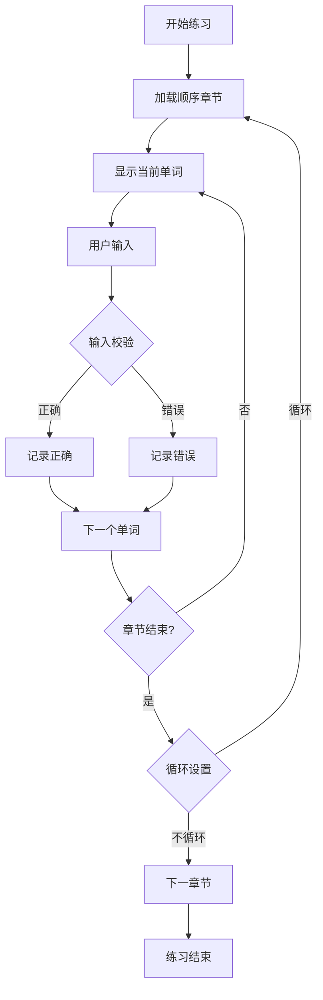

# 📚 EnPractice - VS Code英语练习插件项目设计文档

## 🎯 项目概述

### 项目背景与目标
EnPractice 是一个专为程序员设计的VS Code英语学习插件，旨在将英语学习无缝集成到日常编程工作流中。项目解决了程序员在编程过程中英语学习与实践脱节的痛点，提供了一个轻量级、高效的英语练习工具。

### 核心价值
- **工作学习一体化**：在编程环境中直接进行英语练习
- **渐进式学习**：支持词汇量从基础到高级的渐进式提升
- **数据驱动**：提供详细的学习进度统计和分析
- **个性化体验**：支持自定义词书和练习模式

---

## 🏗️ 系统架构设计

### 整体架构模式
```
┌─────────────────────────────────────────┐
│              VS Code 宿主环境              │
├─────────────────────────────────────────┤
│  EnPractice 插件架构 (单体插件架构)           │
├─────────────────────────────────────────┤
│ ┌─────────────┐ ┌─────────────┐         │
│ │  练习界面    │ │  设置界面    │         │
│ │(Webview)   │ │(Webview)   │         │
│ └─────────────┘ └─────────────┘         │
├─────────────────────────────────────────┤
│ ┌─────────────┐ ┌─────────────┐         │
│ │ 练习提供者   │ │ 设置提供者   │         │
│ └─────────────┘ └─────────────┘         │
├─────────────────────────────────────────┤
│ ┌─────────────┐ ┌─────────────┐         │
│ │ 词书管理器   │ │ 记录管理器   │         │
│ └─────────────┘ └─────────────┘         │
├─────────────────────────────────────────┤
│          设置管理 & 类型系统               │
├─────────────────────────────────────────┤
│               数据层                     │
│  ┌──────────┐ ┌──────────┐ ┌──────────┐ │
│  │ 词典文件  │ │ 设置文件  │ │ 记录文件  │ │
│  └──────────┘ └──────────┘ └──────────┘ │
└─────────────────────────────────────────┘
```

### 核心设计原则
1. **单一职责原则**：每个模块专注于特定功能
2. **开放封闭原则**：易于扩展新词书和功能
3. **依赖倒置原则**：上层模块不依赖下层具体实现
4. **接口隔离原则**：提供清晰、最小化的接口
5. **分层架构**：表现层、业务层、数据层分离

---

## 📁 项目文件结构与用途说明

### 根目录文件
```
EnPractice/
├── 📄 README.md              # 项目基础介绍和使用说明
├── 📄 PROJECT_DESIGN.md      # 本文档，详细设计说明
├── 📄 PERFORMANCE.md         # 性能优化和架构分析
├── 📄 TESTING_REPORT.md      # 功能测试报告
├── 📄 package.json           # 插件配置和依赖管理
├── 📄 tsconfig.json          # TypeScript编译配置
├── 📄 .gitignore            # Git忽略文件配置
├── 📄 .vscodeignore         # VS Code打包忽略配置
└── 📄 package-lock.json     # 依赖版本锁定
```

### 核心源代码目录 (/src)
```
src/
├── 📄 extension.ts           # 插件主入口文件
├── 📄 types.ts              # TypeScript类型定义
├── 📄 settings.ts           # 全局设置管理
├── 📄 wordbooks.ts          # 词书文件管理
├── 📄 practiceProvider.ts   # 练习界面提供者
├── 📄 settingsProvider.ts   # 设置界面提供者
├── 📄 analyticsProvider.ts  # 记录界面提供者
├── 📄 dayRecordManager.ts   # 每日记录管理器
├── 📄 dayAnalysisManager.ts # 每日分析管理器
└── 📄 shardedRecordManager.ts # 分片记录管理器
```

### 数据存储目录 (/data)
```
data/
├── 📄 README.md             # 数据文件使用说明
├── 📄 settings.json         # 用户设置持久化
├── 📄 wordbooks.json        # 词书列表配置
├── 📁 dicts/               # 词典文件存储
│   ├── 📄 hongbaoshu-2026.json  # 红宝书词典
│   ├── 📄 NCE_1.json            # 新概念英语第一册
│   ├── 📄 NCE_2.json            # 新概念英语第二册
│   ├── 📄 NCE_3.json            # 新概念英语第三册
│   └── 📄 NCE_4.json            # 新概念英语第四册
├── 📁 records/             # 练习记录存储
│   ├── 📄 {dictId}_main.json    # 主记录文件
│   └── 📄 {dictId}_ch{N}.json   # 章节记录文件
├── 📁 dayRecords/          # 每日记录存储
│   ├── 📄 {date}.json           # 正常模式每日记录
│   ├── 📄 {date}_dictation.json # 默写模式每日记录
│   └── 📄 totalRecords.json     # 总记录文件
└── 📁 dayRecordsAnalyze/   # 每日分析报告存储
    └── 📄 {date}_analysis.json  # 每日分析报告
```

### 编译输出目录 (/out)
```
out/
├── 📄 extension.js          # 编译后的主入口
├── 📄 *.js                  # 各模块编译后的JavaScript
└── 📄 *.js.map             # 源码映射文件（调试用）
```

### 静态资源目录 (/media)
```
media/
├── 🖼️ en.svg                # 插件图标
└── 🖼️ *.svg                # 其他UI图标
```

---

## 🔧 核心模块设计

### 1. 插件主入口 (extension.ts)
**职责**：插件生命周期管理和依赖注入
```typescript
// 核心功能
- 插件激活和注销
- 命令注册
- 视图容器初始化
- 全局状态管理
- 每日记录文件初始化
- 分析报告生成检查
```

**设计模式**：单例模式 + 依赖注入
**关键接口**：
- `activate(context: ExtensionContext)`
- `deactivate()`

### 2. 类型系统 (types.ts)
**职责**：全局类型定义和数据结构设计
```typescript
// 核心数据结构
interface PluginSettings        # 插件设置
interface WordData             # 单词数据
interface WordBookInfo         # 词书信息
interface WordRecord           # 单词练习记录
interface ChapterRecord        # 章节练习记录
interface DictRecord           # 词典练习记录
interface DayRecord           # 每日记录
interface DayDictRecord       # 每日词典记录
interface DayChapterRecord    # 每日章节记录
type PracticeMode = 'normal' | 'dictation'  # 练习模式
```

**设计原则**：类型安全 + 向前兼容

### 3. 设置管理 (settings.ts)
**职责**：用户配置的读取、写入和验证
```typescript
// 核心功能
- 设置文件持久化
- 配置验证和默认值
- 设置更新通知
```

**存储策略**：文件系统 + 内存缓存

### 4. 词书管理 (wordbooks.ts)
**职责**：词典文件的加载、验证和管理
```typescript
// 核心功能
- 词书列表读取
- 词典文件加载
- 数据格式验证
- 词书切换管理
```

**支持格式**：JSON词典文件
**数据结构**：标准化单词条目

### 5. 练习提供者 (practiceProvider.ts)
**职责**：核心练习功能的实现和界面管理
```typescript
// 核心功能
- Webview界面管理
- 练习逻辑控制
- 用户输入处理
- 进度跟踪和记录
- 顺序模式练习
- 每日记录更新
```

**架构模式**：MVP (Model-View-Presenter)
**交互方式**：消息传递机制

### 6. 设置提供者 (settingsProvider.ts)
**职责**：设置界面和配置管理
```typescript
// 核心功能
- 设置界面渲染
- 配置项管理
- 词书列表显示
- 实时设置同步
```

**UI模式**：服务端渲染 + 客户端交互

### 7. 记录提供者 (analyticsProvider.ts)
**职责**：记录界面和报告展示
```typescript
// 核心功能
- 记录界面渲染
- 统计数据展示
- 学习进度可视化
- 每日报告查看
```

### 8. 每日记录管理器 (dayRecordManager.ts)
**职责**：每日练习记录的管理和存储
```typescript
// 核心功能
- 每日记录文件创建和管理
- 单词练习记录（去重）
- 按练习模式区分记录
- 总记录维护
- 分析状态管理
```

**存储策略**：按日期和模式分文件存储

### 9. 每日分析管理器 (dayAnalysisManager.ts)
**职责**：每日练习数据的分析和报告生成
```typescript
// 核心功能
- 每日分析报告生成
- 多模式数据整合
- 词典详细信息获取
- 分析状态更新
- 缺失报告检查
```

### 10. 分片记录管理器 (shardedRecordManager.ts)
**职责**：高性能的练习数据存储和管理
```typescript
// 核心功能
- 分片存储策略
- 按需加载机制
- 数据一致性保证
- 统计数据计算
```

**存储架构**：主文件 + 章节分片
**性能优化**：内存占用减少550倍

---

## 🎮 核心功能设计

### 1. 智能练习系统

#### 单模式练习设计
```
顺序练习模式：
├── 按词典顺序分章节
├── 固定章节内容
└── 线性进度追踪
```

#### 练习流程设计


### 2. 分片存储系统

#### 存储架构设计
```
词典记录存储：
┌─────────────────┐
│   主记录文件     │  # {dictId}_main.json
├─────────────────┤
│ - 词典基本信息   │
│ - 全局统计数据   │
│ - 当前练习进度   │
└─────────────────┘
         │
    ┌────┴────┐
    ▼         ▼
┌─────────┐ ┌─────────┐
│ 章节文件1│ │ 章节文件N│  # {dictId}_ch{N}.json
├─────────┤ ├─────────┤
│章节统计  │ │章节统计  │
│单词记录  │ │单词记录  │
└─────────┘ └─────────┘
```

#### 性能优化策略
- **按需加载**：只加载当前章节数据
- **异步写入**：不阻塞用户操作
- **缓存机制**：热点数据内存缓存
- **批量操作**：减少文件I/O次数

### 3. 每日记录系统

#### 存储架构设计
```
每日记录存储：
┌─────────────────┐
│   总记录文件     │  # totalRecords.json
├─────────────────┤
│ - 练习日期列表   │
│ - 分析生成状态   │
└─────────────────┘
         │
    ┌────┴────┐
    ▼         ▼
┌─────────┐ ┌─────────┐
│ 正常模式 │ │ 默写模式 │  # {date}.json, {date}_dictation.json
├─────────┤ ├─────────┤
│词典记录  │ │词典记录  │
│章节记录  │ │章节记录  │
│单词记录  │ │单词记录  │
└─────────┘ └─────────┘
```

#### 记录管理策略
- **自动创建**：插件启动时自动创建当日记录文件
- **模式区分**：正常模式和默写模式分别记录
- **去重机制**：每天每个单词只记录一次
- **按需加载**：只在需要时读取记录文件

### 4. 数据映射机制
```
用户练习层面 ← → 章节内索引 ← → 实际单词数据
       ↓                ↓               ↓
   练习界面显示       章节内序号        实际单词数据
```

---

## 🎨 用户界面设计

### 1. 练习界面 (Practice View)
```
┌─────────────────────────────────────┐
│ 📊 章节信息栏                        │
│ 章节: 1/90 | 单词: 3/10             │
│ [章节选择下拉框]                     │
├─────────────────────────────────────┤
│ 📝 单词显示区                        │
│                                     │
│        [r] [e] [m] [o] [t] [e]      │
│                                     │
│      美: /rɪˈmot/  英: /rɪˈməʊt/    │
│         远程的 (adj.), 遥控器 (n.)    │
├─────────────────────────────────────┤
│ ⌨️ 输入区                           │
│ [                                 ] │
│ 请在这里输入...                      │
└─────────────────────────────────────┘
```

**交互特性**：
- 实时字母高亮反馈
- 错误抖动动画
- 成功缩放动画
- 键盘快捷键支持

### 2. 设置界面 (Settings View)
```
┌─────────────────────────────────────┐
│ 🔧 English Practice Settings       │
├─────────────────────────────────────┤
│ 📚 词书管理                          │
│ ┌─────────────────────────────────┐ │
│ │ [红宝书2026] [当前使用]           │ │
│ │ 4858个单词                       │ │
│ │                      [切换]     │ │
│ ├─────────────────────────────────┤ │
│ │ [新概念英语-1]                   │ │
│ │ 900个单词                        │ │
│ │                      [切换]     │ │
│ └─────────────────────────────────┘ │
├─────────────────────────────────────┤
│ ⚙️ 练习设置                          │
│ 每章单词数: 10个 (固定)              │
│ 练习模式: 顺序练习 (固定)             │
│ 单章循环: [✓] 已开启                │
└─────────────────────────────────────┘
```

**功能特性**：
- 词书实时切换
- 设置即时生效
- 状态实时同步

### 3. 记录界面 (Records View)
```
┌─────────────────────────────────────┐
│ 📊 学习记录                       │
├─────────────────────────────────────┤
│ 📅 日期选择                          │
│ [2025-08-26] [◀] [▶] [今日]          │
├─────────────────────────────────────┤
│ 📈 总体统计                          │
│ 总词典数: 2                         │
│ 总章节数: 15                        │
│ 总单词数: 126                       │
├─────────────────────────────────────┤
│ 📚 词典详情                          │
│ 红宝书2026                          │
│ 正常模式: 8章 64词                  │
│ 默写模式: 5章 42词                  │
│                                     │
│ 新概念英语-1                        │
│ 正常模式: 2章 18词                  │
│ 默写模式: 0章 0词                   │
└─────────────────────────────────────┘
```

**功能特性**：
- 按日期查看学习情况
- 多模式数据对比
- 词典详细统计
- 学习趋势分析

---

## 📊 数据存储设计

### 1. 设置数据 (settings.json)
```json
{
  "currentWordbook": "nce1",
  "wordsPerChapter": 10,
  "practiceMode": "sequential",
  "showPhonetics": true,
  "autoNextWord": false,
  "chapterLoop": true,
  "lastUpdated": "2025-08-26",
  "currentChapter": 1,
  "currentWordIndex": 3
}
```

### 2. 词书配置 (wordbooks.json)
```json
[
  {
    "id": "hongbaoshu-2026",
    "name": "红宝书2026",
    "description": "考研英语词汇红宝书",
    "length": 4858,
    "category": "考研",
    "tags": ["考研", "高频"],
    "url": "hongbaoshu-2026.json"
  }
]
```

### 3. 词典数据结构
```json
[
  {
    "usphone": "/rɪˈmot/",
    "ukphone": "/rɪˈməʊt/",
    "name": "remote",
    "trans": [
      "远程的 (adj.)",
      "遥控器 (noun)"
    ]
  }
]
```

### 4. 练习记录结构
```json
{
  "dictId": "nce1",
  "dictName": "新概念英语-1",
  "totalWords": 900,
  "totalChapters": 90,
  "currentChapter": 1,
  "currentWordIndex": 3,
  "practiceMode": "sequential",
  "chapterLoop": true,
  "globalStats": {
    "totalPracticeCount": 4,
    "totalErrorCount": 1,
    "totalCompletedWords": 0,
    "overallCorrectRate": 75
  }
}
```

### 5. 每日记录结构 (dayRecords/{date}.json)
```json
{
  "date": "2025-08-26",
  "dicts": {
    "hongbaoshu-2026": {
      "dictId": "hongbaoshu-2026",
      "dictName": "红宝书2026",
      "chapters": {
        "1": {
          "chapterNumber": 1,
          "words": ["remote", "remove", "report"]
        },
        "2": {
          "chapterNumber": 2,
          "words": ["research", "resource", "response"]
        }
      }
    }
  }
}
```

### 6. 总记录结构 (dayRecords/totalRecords.json)
```json
[
  {
    "date": "2025-08-25",
    "analysisGenerated": true
  },
  {
    "date": "2025-08-26",
    "analysisGenerated": false
  }
]
```

### 7. 分析报告结构 (dayRecordsAnalyze/{date}_analysis.json)
```json
{
  "date": "2025-08-26",
  "generatedAt": "2025-08-26T10:30:00.000Z",
  "normalMode": {
    "dicts": {
      "hongbaoshu-2026": {
        "dictId": "hongbaoshu-2026",
        "dictName": "红宝书2026",
        "chapters": {
          "1": {
            "chapterNumber": 1,
            "wordCount": 3,
            "words": ["remote", "remove", "report"]
          }
        }
      }
    }
  },
  "dictationMode": {
    "dicts": {
      "hongbaoshu-2026": {
        "dictId": "hongbaoshu-2026",
        "dictName": "红宝书2026",
        "chapters": {
          "2": {
            "chapterNumber": 2,
            "wordCount": 2,
            "words": ["research", "resource"]
          }
        }
      }
    }
  },
  "summary": {
    "totalDicts": 1,
    "totalChapters": 2,
    "totalWords": 5,
    "dicts": [
      {
        "dictId": "hongbaoshu-2026",
        "dictName": "红宝书2026",
        "totalWordsInDict": 4858,
        "normalMode": {
          "chapters": 1,
          "words": 3
        },
        "dictationMode": {
          "chapters": 1,
          "words": 2
        }
      }
    ]
  }
}
```

---

## 🚀 性能优化策略

### 1. 内存优化
- **分片加载**：只加载当前章节，内存占用从1.1MB降至2KB
- **懒加载**：按需加载词书和记录数据
- **对象池**：复用频繁创建的对象
- **垃圾回收**：及时释放不用的引用

### 2. I/O优化
- **异步操作**：所有文件操作异步化
- **批量写入**：合并多个小的写操作
- **写入缓冲**：延迟非关键数据的写入
- **读取缓存**：热点数据内存缓存

### 3. 计算优化
- **增量计算**：只计算变化的统计数据
- **预计算**：提前计算固定的统计结果
- **算法优化**：使用高效的排序和搜索算法

### 4. 用户体验优化
- **响应式设计**：界面自适应不同窗口大小
- **渐进加载**：数据分批加载避免阻塞
- **错误恢复**：自动处理异常情况
- **状态保持**：保持用户的操作状态

---

## 🔒 错误处理与容错设计

### 1. 数据完整性保护
```typescript
// 数据一致性检查
if (record.totalWords !== actualWords) {
    console.log('数据不一致，自动修复');
    record.totalWords = actualWords;
    record.totalChapters = Math.ceil(actualWords / 10);
    await this.saveMainRecord(record);
}
```

### 2. 优雅降级策略
```typescript
// 数据加载失败降级处理
try {
    return await this.loadChapterData();
} catch (error) {
    console.warn('数据加载失败，使用默认数据');
    return this.getDefaultChapterData();
}
```

### 3. 异常恢复机制
- **自动重试**：关键操作失败时自动重试
- **数据备份**：重要数据变更前自动备份
- **状态恢复**：异常中断后恢复到上次稳定状态
- **错误上报**：详细的错误日志便于调试

---

## 🧪 测试策略

### 1. 单元测试
- **模块测试**：每个核心模块的独立测试
- **接口测试**：API接口的输入输出验证
- **边界测试**：极端情况和边界条件测试

### 2. 集成测试
- **数据流测试**：端到端数据流验证
- **界面交互测试**：用户操作流程测试
- **性能基准测试**：关键操作的性能指标

### 3. 用户体验测试
- **可用性测试**：界面易用性评估
- **兼容性测试**：不同VS Code版本兼容性
- **压力测试**：大词典和高频操作测试

---

## 📈 扩展性设计

### 1. 功能扩展点
- **新练习模式**：听力练习、语法练习等
- **统计增强**：学习曲线、遗忘曲线分析
- **社交功能**：学习排行榜、成就系统
- **智能推荐**：个性化学习路径推荐
- **多维度分析**：时间、词典、章节等多维度分析

### 2. 技术扩展点
- **多语言支持**：支持其他语言学习
- **云端同步**：跨设备学习进度同步
- **AI集成**：智能纠错和发音评估
- **插件生态**：第三方插件和主题支持

### 3. 数据扩展点
- **多媒体支持**：音频、图片、视频内容
- **标准化格式**：支持标准词典格式导入
- **数据导出**：学习数据导出和备份
- **API开放**：提供开放API供第三方使用

---

## 🛠️ 开发工作流

### 1. 开发环境
```bash
# 安装依赖
npm install

# 开发模式编译
npm run compile

# 监视模式（自动编译）
npm run watch

# 调试模式
F5 (在VS Code中)
```

### 2. 项目结构约定
- **模块化设计**：每个文件专注单一职责
- **类型优先**：TypeScript严格模式
- **注释规范**：JSDoc格式文档注释
- **命名约定**：驼峰命名法和语义化命名

### 3. 代码质量保证
- **类型检查**：TypeScript编译时类型验证
- **代码审查**：关键变更需要代码审查
- **测试覆盖**：核心功能测试覆盖率>80%
- **性能监控**：关键操作性能指标监控

---

## 📚 技术栈总结

### 核心技术
- **TypeScript 4.9.4**：类型安全的JavaScript超集
- **VS Code Extension API**：VS Code插件开发框架
- **Node.js 16.x**：JavaScript运行时环境

### 开发工具
- **TSC**：TypeScript编译器
- **npm**：包管理和构建工具
- **VS Code**：开发和调试环境

### 架构模式
- **插件架构**：基于VS Code扩展机制
- **MVP模式**：Model-View-Presenter分离
- **模块化设计**：功能模块独立可测试
- **事件驱动**：异步消息传递机制

---

## 🎯 未来规划

### 短期目标 (v0.1.x)
- [x] 基础练习功能完善
- [x] 分片存储性能优化
- [x] 顺序练习算法实现
- [x] 每日记录管理功能
- [x] 学习分析报告功能
- [ ] 用户反馈收集和优化
- [ ] 更多词典资源集成

### 中期目标 (v0.2.x)
- [ ] 学习统计dashboard
- [ ] 个性化学习建议
- [ ] 词汇掌握度评估
- [ ] 学习计划制定功能

### 长期目标 (v1.0+)
- [ ] 多语言学习支持
- [ ] 云端数据同步
- [ ] AI智能助手集成
- [ ] 社区功能和分享

---

## 🎉 总结

EnPractice项目通过精心设计的架构和技术选型，成功地将英语学习集成到程序员的日常工作流中。项目的核心优势在于：

1. **高性能分片存储**：解决了大词典的性能问题
2. **简单有效的练习模式**：提供稳定可靠的顺序练习体验
3. **模块化设计**：易于维护和扩展
4. **用户体验优先**：响应迅速、操作直观
5. **数据安全可靠**：完善的错误处理和数据保护
6. **学习追踪完善**：每日记录和分析报告功能

该项目不仅是一个功能完整的VS Code插件，更是一个可扩展、高性能的英语学习平台的技术基础。通过持续的优化和功能扩展，EnPractice将为广大程序员提供更好的英语学习体验。

---

**项目状态**: 🚀 **核心功能已完成，持续优化中** 🚀

*最后更新时间: 2025-08-27*